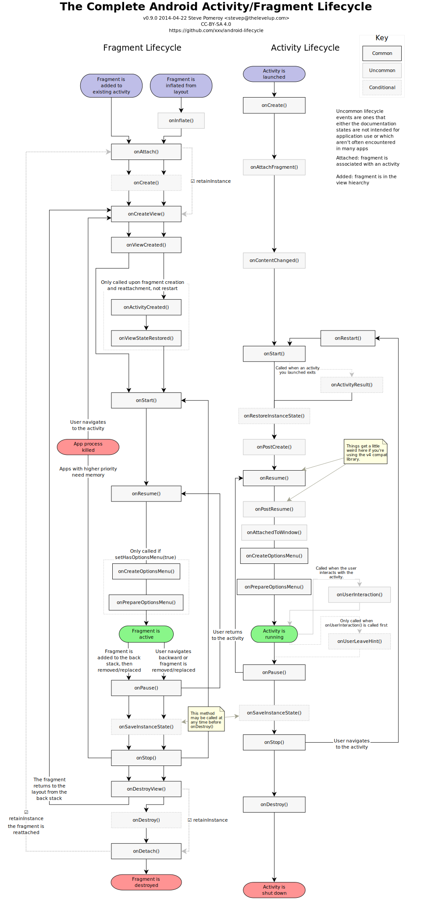

# Android基础题-四大组件

包含Android四大组件Activity，Service，Broadcast，ContentProvider，以及Fragment的常见问题，还包括Android中一些基础的数据结构和接口，如Bundle，序列化等。

## 目录

1.	Activity和Fragment的生命周期
2.	Activity横竖屏切换的生命周期
3.	对话框出现时Activity的生命周期
4.  通知栏下滑时Activity的生命周期
5.  Activity如何保存状态
6.  Activity的启动模式
7.  跨应用启动的Activity，位于哪个栈中？
8.  Service生命周期 
9.  IntentService的作用
10. LocalBroadcast原理
11. bundle的数据结构，如何存储，既然有了Intent.putExtra，为什么还要用bundle？
12. Serializable和Parcelable区别
13. 不同应用可以存在于同一进程吗？

## Activity和Fragment的生命周期

从Activity启动到最终Activity被销毁，总共经历生命周期：

onCreate() -> onStart() -> onResume() -> onPause() -> onStop() -> onDestroy()

onResume()和onPause()决定了Activity是否在前台
onStart()和onStop()决定了Activity是否可见
onStop()之后，activity重新恢复到前台，会调onRestart()方法

从Fragment创建到最终Fragment被销毁

onAttach() -> onCreate() -> onCreateView() -> onActivityCreated() -> onStart() -> onResume() -> onPause() -> onStop() -> onDestroyView() -> onDestroy() -> onDetach()

更具体的，可以参考下图：

## 横竖屏切换对Activity生命周期的影响

Activity的android:configChanges属性设置的值表示，当Activity的这些属性值发生时，Activity自行处理。

配置 android:configChanges="orientation|keyboardHidden|screenSize"，不会销毁 activity，且只调用 onConfigurationChanged方法。

其它情况下，包括不设置Activity的android:configChanges属性，切屏会重新调用各个生命周期，切横屏时会执行一次，切竖屏时会执行一次。

## 对话框出现时activity的生命周期

没有影响, View本身是通过WindowManager.addView()来添加的。

## 通知栏下滑时activity的生命周期

没有影响

## Activity保存状态

onSaveInstanceState() 和 onRestoreInstanceState()

## Activity 启动模式

任务栈是一种后进先出的结构。位于栈顶的Activity处于焦点状态,当按下back按钮的时候,栈内的Activity会一个一个的出栈,并且调用其onDestory()方法。如果栈内没有Activity,那么系统就会回收这个栈,每个APP默认只有一个栈,以APP的包名来命名.

standard : 标准模式,每次启动Activity都会创建一个新的Activity实例,并且将其压入任务栈栈顶,而不管这个Activity是否已经存在。Activity的启动三回调(onCreate()->onStart()->onResume())都会执行。

singleTop : 栈顶复用模式.这种模式下,如果新Activity已经位于任务栈的栈顶,那么此Activity不会被重新创建,所以它的启动三回调就不会执行,同时Activity的onNewIntent()方法会被回调.如果Activity已经存在但是不在栈顶,那么作用与standard模式一样.

singleTask: 栈内复用模式.创建这样的Activity的时候,系统会先确认它所需任务栈已经创建,否则先创建任务栈.然后放入Activity,如果栈中已经有一个Activity实例,那么这个Activity就会被调到栈顶,onNewIntent(),并且singleTask会清理在当前Activity上面的所有Activity.(clear top)

singleInstance : 加强版的singleTask模式,这种模式的Activity只能单独位于一个任务栈内,由于栈内复用的特性,后续请求均不会创建新的Activity,除非这个独特的任务栈被系统销毁了
Activity的堆栈管理以ActivityRecord为单位,所有的ActivityRecord都放在一个List里面.可以认为一个ActivityRecord就是一个Activity栈

# 跨应用启动的Activity，位于哪个栈中？
被启动的Activity如果启动模式不是singleInstance，那么和启动Activity位于同一栈中。

## Service生命周期

Service四个手动调用的方法 startService() stopService() bindService() unBindService()

Service五个内部自动调用的方法 onCreate() onStartCommand() onDestroy() onBind() onUnbind()

startService开启的Service，调用者退出后Service仍然存在； 
bindService开启的Service，调用者退出后，Service随着调用者销毁。

# IntentService的作用

IntentService继承自Service类，内部包含了一个工作线程用于处理异步任务，通过Context.startService(Intent)传递Intent任务，任务执行完成后会自动关闭自己。

# LocalBroadcast原理

BroadcastReceiver采用的binder方式实现跨进程间的通信；
LocalBroadcastManager使用Handler通信机制，保证了只在当前进程生效。

# bundle的数据结构，如何存储，既然有了Intent.putExtra，为什么还要用bundle？

bundle的内部结构其实是Map，传递的数据可以是基本类型或它们对应的数组，也可以是对象或对象数组。当Bundle传递的是对象或对象数组时，必须实现Serializable 或Parcelable接口。

Intent是Android的一种机制, 借助Android提供的Api，如
startActivity(Intent intent);
startService(Intent service);
sendBroadcast(Intent intent);
bindService(Intent service, ServiceConnection conn, int flags);
等方法，我们可以把intent发送给Android，Android收到后会做相应的处理，启动Activity，发送广播给BroadcastReceiver，启动Service或者绑定Service。

Intent还可以附加各种数据类型，其中就包括Bundle：Intent.putExtra(String name, Bundle value),同时Intent内部是持有一个Bundle对象的,mExtras本身就是个Bundle。而Bundle仅仅是一种键值对数据结构，存储字符串键与限定类型值之间映射关系。如Activity状态保存和回复，fragment数据传递等。

# Serializable和Parcelable区别

Serializable是java提供的一个序列化接口，只需要在类中申明一个serialVersionUID的静态常量，就可以自动实现默认的序列化过程。
使用简单但是相对来说开销比较大。

Parcelable是Android中的序列化方式，使用稍微麻烦但是效率高。

# 不同应用可以存在于同一进程吗？

可以，AndroidManifest文件里，application标签下指定相同的sharedUserId和process,并且app使用相同的签名证书即可。